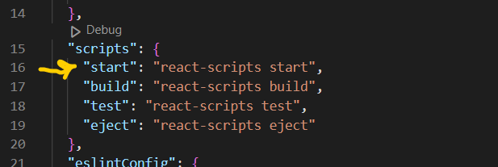

# Instructions

To initialize a new React application, you must ensure that you have Node installed on your computer.
<br/>
You can verifiy the installation by runnig the command in your terminal/command prompt, and pressing Enter:
```
node --version
```
If Node is installed on your computer, it would return the version of Node installed on your computer. 

## How to create a react application
> TO create a React application , use the command :
```
npx create-react-app <name-of-application>
```

## How to clone an existing repository from Github
Note that you can only clone an application that is public, or that you have been given permission to clone. The below command is used to clone an existing repository from GitHub:
```
git clone <address-of-repository>
```
Example `git clone https://github.com/Chiamaka-Okosa/Elitebags.git`

## Running you React application
> When this application is first pulled from the repository, it's good practice to run the command `npm install` so as to ensure that all node_modules required for the application to work, are installed.

> To run this React application, open up a terminal/command prompt in the root directory of the application and run the command:
```
npm start
```
All commands can be found in the `scripts` section of the `package.json` file, as shown int he screenshot below:


